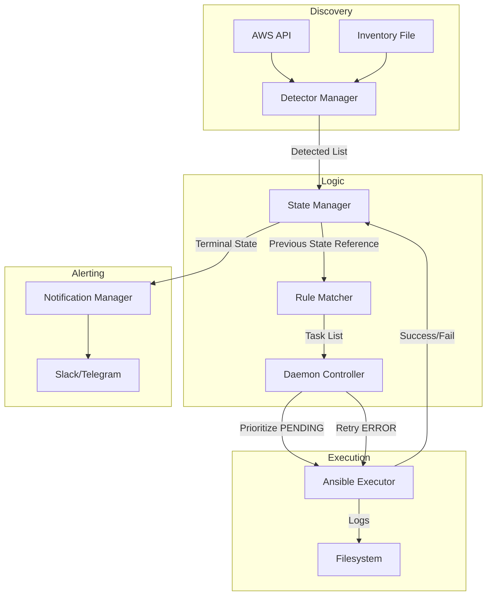

# Architecture Documentation

## 🏗️ System Overview

Ansible AutoProvisioner is a state-driven automation daemon designed for infrastructure lifecycle management. It acts as an autonomous agent that bridges the gap between infrastructure deployment and configuration management.

### The "Loop of Truth"
The core of the system is the **Reconciliation Loop**. In every cycle (defined by `interval`), the system performs three critical phases:
1. **Detection Phase**: What actually exists right now?
2. **Matching Phase**: What *should* be running on what exists?
3. **Execution Phase**: Make the reality match the desired state.

## 🧱 Component Architecture

### 1. Detector System (`detectors/`)
Discovers infrastructure nodes.
- **Static Detector**: Watches a standard Ansible `inventory.ini` or YAML file.
- **AWS Detector**: Polls the EC2 API for instances matching specific tags or regions.
- **Manager**: Deduplicates instances across multiple detectors and provides a unified "Detected" list.

### 2. State Management (`state.py`)
The "Brain" of the system.
- **Persistence**: Saves state to `state.json` atomically.
- **Status Lifecycle**:
  - `PENDING`: Ready to be provisioned (new or retry-queued).
  - `RUNNING`: Handled by an Ansible worker.
  - `SUCCESS`: Goal achieved.
  - `ERROR`: Logic failure or max retries hit.
  - `ORPHANED`: Host vanished from source but still in state.
- **Thread Safety**: Uses file-level and object-level locking to prevent race conditions during concurrent execution.

### 3. Rule Matching (`matcher.py`)
The "Policy" engine.
- Matches `DetectedInstance` attributes (tags, groups, variables) against rule criteria.
- Returns an ordered list of playbook tasks for the instance to perform.

### 4. Execution Engine (`executor.py`)
The "Hands" of the system.
- Uses `ansible-runner` (or direct subprocess) to execute playbooks.
- **Isolation**: Each instance gets its own worker thread and log directory.
- **Telemetry**: Captures real-time output and streams it to `.log` files.

### 5. Notification System (`notifications/`)
The "Voice" of the system.
- **Standardized Interface**: Allows pluggable notifiers (Slack, Telegram, etc.).
- **Deduplication**: Tracks the `notified` status to ensure you only get one alert per terminal status.

## 🔄 Data Flow Diagram

## �️ Design Principles

- **Idempotency**: The system ensures playbooks are only run when necessary and tracks history to avoid infinite loops.
- **Crash Consistency**: Persistent state ensures that if the process dies, it resumes exactly where it stopped.
- **Scalability**: Thread-pooled execution allows handling hundreds of instances concurrently without blocking the main monitoring loop.
- **Flexibility**: Decoupling detectors from executors allows the system to easily add new infrastructure sources (GCP, Azure, etc.).
